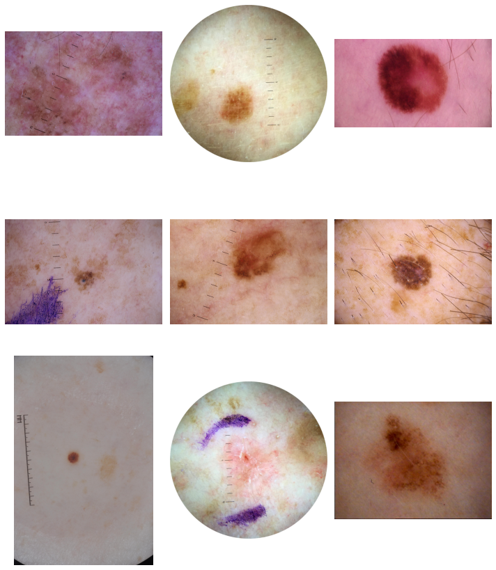
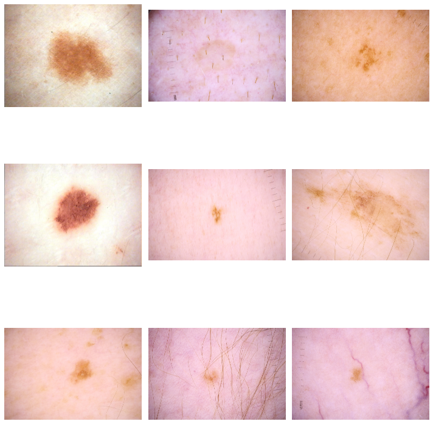
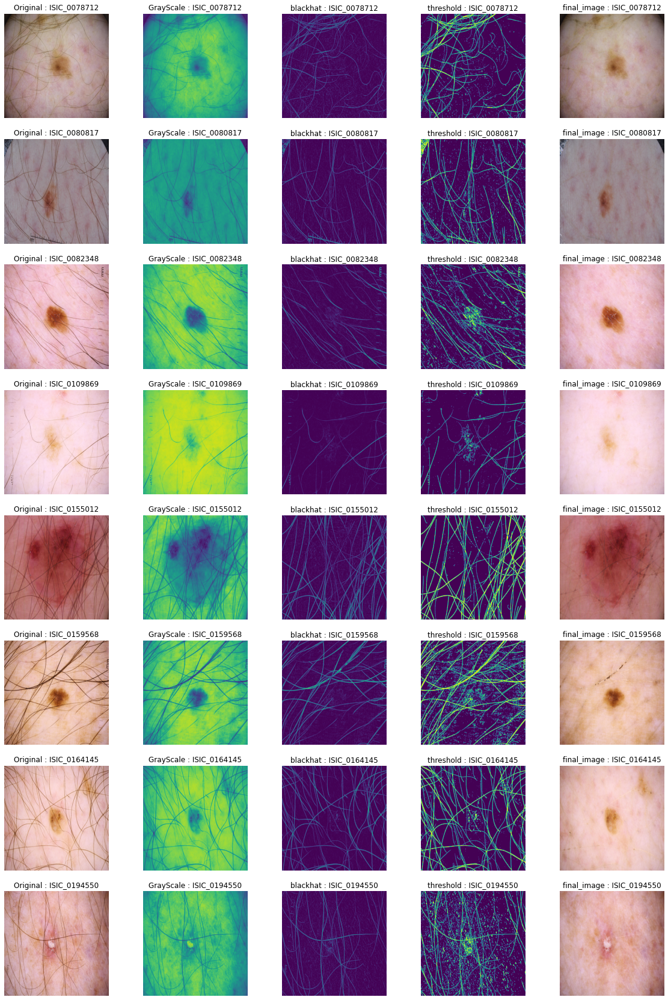

# SIIM-ISIC-Melanoma-classification-Kaggle-challange

## plotted images
1> is malignent images, 2> is benign images,3> inpainted images(after hair removal)4> anatom_site_general_challenge pi chart, 5> count of age approx, 6> count of diagnosis and many more in the notebooks.
<pre>
    
</pre>

## Model structure for VGG:
```python
model.add(VGG19(include_top=False, weights='imagenet', input_shape= inputShape))
model.add(Flatten())
model.add(Dense(32))
model.add(LeakyReLU(0.001))
model.add(Dense(16))
model.add(LeakyReLU(0.001))
model.add(Dense(1, activation='sigmoid'))
```

## ResNet101 Model summary:
```python
Model: "sequential"
_________________________________________________________________
Layer (type)                 Output Shape              Param #   
=================================================================
resnet101 (Model)            (None, 7, 7, 2048)        42658176  
_________________________________________________________________
global_average_pooling2d (Gl (None, 2048)              0         
_________________________________________________________________
dense (Dense)                (None, 1)                 2049      
=================================================================
Total params: 42,660,225
Trainable params: 42,554,881
Non-trainable params: 105,344
_________________________________________________________________

``` 

## File structure:
1) ResNet101 training inside `resnet101-with-focal-loss-and-img-aug.ipynb`
2) VGG16 training is in `baseline-submission-keras-vgg16`
3) Image Analysis is in `cancer-detection-analysis.ipynb` 
4) Tabular data analysis is in `eda-w-plotly-and-stacking-on-tabular-data-0-685.ipynb`

## Future work:
1. woking on the image analysis more
2. woking on bettering the model performance.
